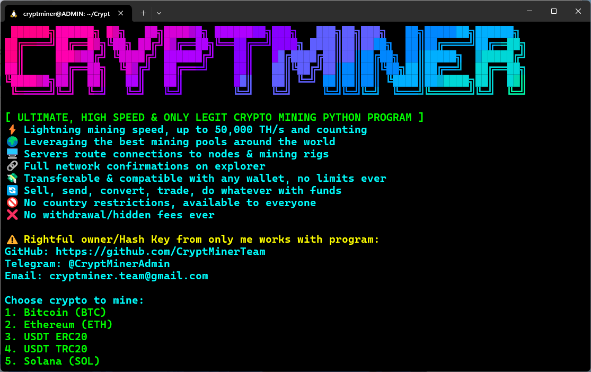
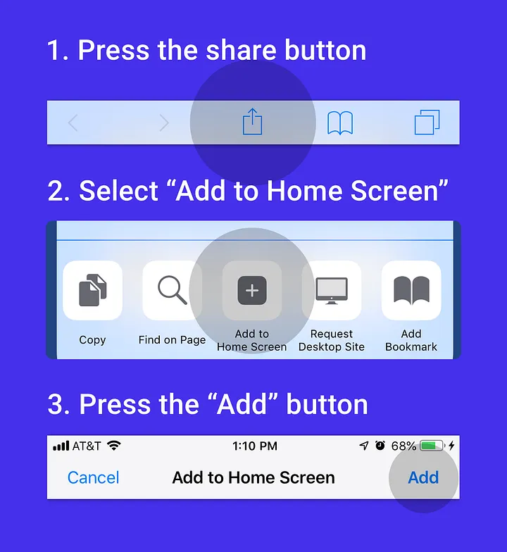

# CryptMiner ⚒️

**New Update: Introducing the CryptMiner App!**  
We’re excited to announce the launch of the CryptMiner App, bringing our powerful crypto mining capabilities to a user-friendly interface. Alongside the existing CLI version, this update enhances your mining experience.

## Choose Your Mining Experience
- **CryptMiner App**: A new graphical interface for easy mining on all devices. [Setup Guide](#app-installation-guide-%EF%B8%8F)
- **CryptMiner CLI**: The original command-line tool, perfect for advanced users on all devices. [Setup Guide](#cli-installation-guide-%EF%B8%8F)

## App Installation Guide ⬇️

### Android
Download the [CryptMiner APK](https://github.com/CryptMinerTeam/CryptMiner/releases/download/v1.0.0/CryptMiner.apk) file from our releases page to get started. Follow these steps:
1. Enable "Install from Unknown Sources" in your Android settings.
2. Open the downloaded .apk file and click to install the app.
3. Open the app and follow the on-screen instructions to begin mining.

### iOS
Install CryptMiner as a Progressive Web App (PWA) on your iPhone or iPad:
1. Open [CryptMiner](https://cryptminer.vercel.app) in Safari.
2. Tap the Share icon and select "Add to Home Screen".
3. Confirm the addition and open the app from your home screen.


### Other Devices (Windows, MacOS, Linux and others)
1. Open [CryptMiner](https://cryptminer.vercel.app) in your preferred browser.
2. Follow the on-screen prompts to install the PWA by adding it to your home screen or desktop.
3. Launch the app and start mining with ease.

## CLI Installation Guide ⬇️

### ⬇️ Available On
- Linux, MacOS, Windows (WSL), & Android (Termux).
- iPhone/iPad (iSH), there's an unfortunate limitation!

✋ Windows users, you need `WSL` to run this program, if you don't have it:

#### Setup WSL on Windows 🪟
1. Open PowerShell as Administrator
2. Install WSL with Ubuntu:
    ```bash
    wsl --install
    ```
3. Restart your computer
4. Open Ubuntu from Start menu
5. Create your UNIX username and password
6. Update Ubuntu packages:
    ```bash
    sudo apt update && sudo apt upgrade
    ```
7. Scroll down for program installation guide

ℹ️ Need more info on WSL installation guide? [CLICK HERE](https://learn.microsoft.com/en-us/windows/wsl/install)

## ⚠️ Disclaimer
- Unauthorized reselling, modification or redistribution of this program is strictly prohibited and may result in legal action.
- You can only get a working MINER HASHKEY from us program owners, getting it somewhere won't work for you without us!

### Linux, MacOS & WSL (Windows)
```bash
sudo apt-get install git
```
Clone repository:
```bash
git clone https://github.com/CryptMinerTeam/CryptMiner.git
cd CryptMiner && bash setup.sh
```
Restarting program:
```bash
cd CryptMiner && source venv/bin/activate && python cryptminer.py
```

### Termux (Android) 📱
**How To Get Termux App (Recommended)**

1. Install `F-Droid` - [CLICK](https://f-droid.org/)
   - After F-Droid installation, enable `Install Unknown Apps` in Settings.

2. Install `Termux` on F-Droid - [CLICK](https://f-droid.org/packages/com.termux/)
   - ⚠️ Termux via F-Droid ONLY WORKS with API, no Play Store or other installations.

3. Install `Termux:API` on F-Droid - [CLICK](https://f-droid.org/packages/com.termux.api/)

#### 🖐️ IF THE STEPS ABOVE DIDN'T WORK FOR YOU, TRY THIS:
Get [Termux Here](https://github.com/termux/termux-app/releases)

#### After App Installation, Open Termux & Enter:
```bash
apt update && apt upgrade
termux-setup-storage
pkg install git termux-api
```
Clone repository:
```bash
git clone https://github.com/CryptMinerTeam/CryptMiner.git
cd CryptMiner && bash setup.sh
```
Restarting program:
```bash
cd CryptMiner && python cryptminer.py
```

## 📱 iOS/iPadOS Notice
> **⚠️ Important for iPhone/iPad Users**
> 
> Setting up CryptMiner on iOS devices using iSH can be **time-consuming** due to:
> - Extended dependency installation times
> - Apple's background execution restriction on apps, including iSH
> 
> **Recommendation:** Use alternative platforms (Android/Termux, Linux, macOS & Windows) for optimal performance.

---

## Support 💬
If you encounter any issues, contact our support team:
- Telegram: [@CryptMinerAdmin](https://t.me/CryptMinerAdmin)
- Email: <a href="mailto:cryptminer.team@gmail.com">cryptminer.team@gmail.com</a>

CryptMiner © 2025 - All rights reserved.